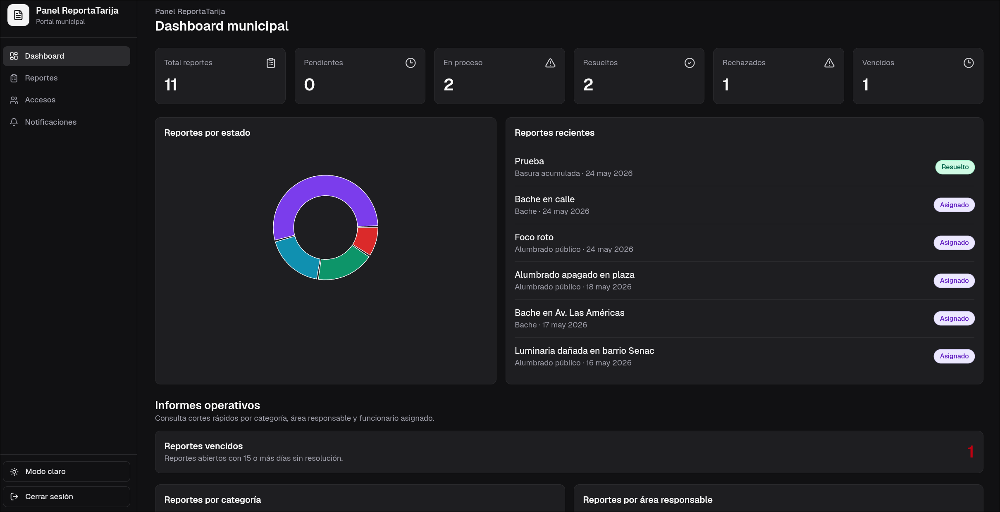
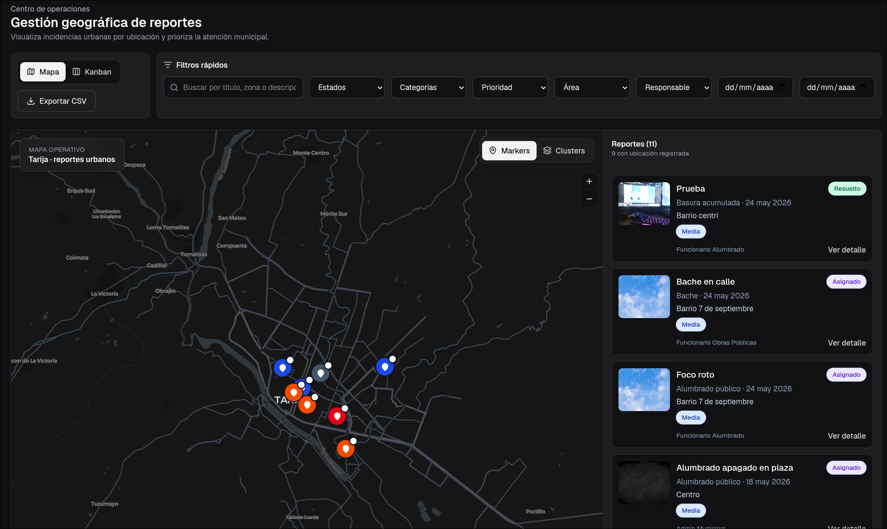
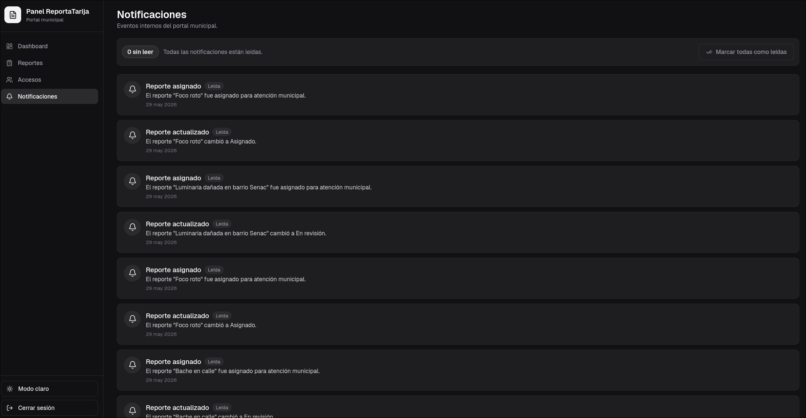
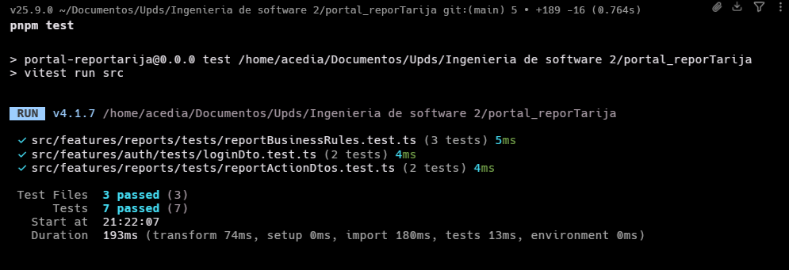
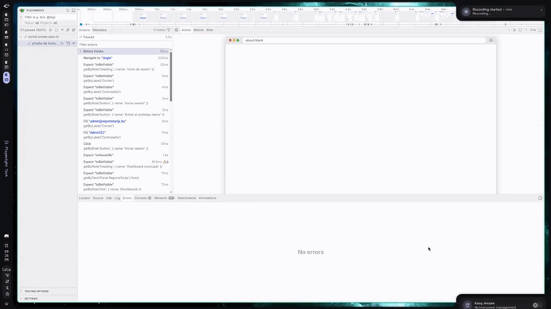

<div align="center">

# 🏛️📱 Ecosistema ReportaTarija

**Plataforma municipal de reporte ciudadano para la gestión de incidencias urbanas en Tarija.**

[](https://portal-web-repor-tarija.vercel.app/)
[](https://upds-my.sharepoint.com/:u:/g/personal/tj_daniel_jimenez_upds_net_bo/IQBXrh1nhsxcS7BfdydhzYlMAfx568MvasHcIqiW2pWjsoY?e=kWhkh3)


---

**Materia:** Ingeniería de Software 2 &nbsp;·&nbsp; **Tema:** Soluciones para el sector público y social  
**Universidad:** UPDS &nbsp;·&nbsp; **Autor:** Jiménez Daniel Gustavo

</div>

---

## 🌐 Acceso en Vivo y Descargas

Puedes interactuar con el ecosistema completo directamente desde los siguientes enlaces:

*   🏛️ **Portal Web Municipal (Producción):** [https://portal-web-repor-tarija.vercel.app/](https://portal-web-repor-tarija.vercel.app/)
*   📱 **App Móvil Ciudadana (Descarga):** [Archivo de instalación en SharePoint](https://upds-my.sharepoint.com/:u:/g/personal/tj_daniel_jimenez_upds_net_bo/IQBXrh1nhsxcS7BfdydhzYlMAfx568MvasHcIqiW2pWjsoY?e=kWhkh3)

---

## 📋 Contexto General

**ReportaTarija** es un ecosistema diseñado para fomentar la participación ciudadana y optimizar la gestión municipal. Se compone de dos aplicaciones front-end que convergen en un único Backend as a Service (BaaS):

1.  📱 **App Móvil Ciudadana:** Desarrollada con React Native/Expo para que los ciudadanos registren incidencias, capturen coordenadas, adjunten evidencia y hagan seguimiento.
2.  🏛️ **Portal Web Municipal:** Desarrollada con React/Vite para que los funcionarios revisen, asignen, actualicen y resuelvan las solicitudes desde un panel administrativo.

Ambos clientes se conectan de forma segura a **InsForge (BaaS)**, el cual centraliza la base de datos PostgreSQL, autenticación y almacenamiento.



---

## 🔄 Flujo Principal del Ecosistema

```text
1. Registro ciudadano (App)    →  El ciudadano crea una cuenta en la aplicación móvil.
2. Creación de reporte (App)   →  Captura coordenadas, foto y detalles del problema urbano.
3. Revisión municipal (Portal) →  Funcionarios ven el reporte en el Dashboard o Mapa.
4. Gestión y asignación (Portal)→ Se asigna a un técnico/área y cambia el estado.
5. Seguimiento (App/Portal)    →  El sistema notifica al ciudadano y registra el avance.
```

<p align="center">
  
  
</p>

---

## 🛠️ Stack Tecnológico Compartido y por Módulo

### Core Compartido
*   **Lenguaje:** [TypeScript](https://www.typescriptlang.org/) (Estricto)
*   **Backend:** InsForge SDK (PostgreSQL + PostgREST + Auth + Storage)
*   **Formularios/Validación:** React Hook Form + Zod
*   **Gestor de Paquetes:** [pnpm](https://pnpm.io/) (Obligatorio)

### 📱 App Móvil (`App-ReporTarija`)
*   **Framework:** React Native + Expo SDK 54 (New Architecture)
*   **Navegación:** Expo Router (File-based)
*   **Sensores:** expo-location, expo-image-picker
*   **Testing:** Jest + ts-jest

### 🏛️ Portal Web (`Portal-web-ReporTarija`)
*   **Framework:** React + Vite
*   **Estilos:** Tailwind CSS + Radix UI + shadcn
*   **Estado/Caché:** TanStack Query
*   **Mapas:** MapLibre GL
*   **Testing:** Vitest + Playwright
*   **Despliegue:** Vercel

---

## 📐 Arquitectura del Proyecto

Ambos proyectos utilizan una arquitectura modular basada en features, maximizando la cohesión y minimizando el acoplamiento. Gracias a este aislamiento de dominios, el sistema es altamente escalable y apto para evolucionar hacia una Línea de Producto de Software (SPL), permitiendo integrar nuevos módulos o funcionalidades en el futuro sin afectar la base existente.

### App Móvil
```text
App-ReporTarija/
├── app/                       # Expo Router (Estructura de Rutas)
│  ├── (tabs)/                 # Pestañas principales (Inicio, Crear, Reportes, etc.)
│  └── report/[id].tsx         # Detalle de reporte
├── src/
│  ├── features/               # Lógica del negocio por Módulo (auth, home, reports)
│  ├── shared/                 # UI básica, constantes y utils reutilizables
│  └── lib/                    # Singletons de conexión (InsforgeClient)
```

### Portal Web
```text
Portal-web-ReporTarija/
├── src/
│  ├── app/                    # Configuración general, rutas y providers
│  ├── features/               # Módulos (auth, dashboard, reports, staff, notifications)
│  ├── shared/                 # Componentes, layout y utilidades reutilizables
│  └── lib/                    # Clientes compartidos (InsForge, TanStack Query)
```

---

## 💾 Modelo de Datos Compartido (BaaS)

La base de datos PostgreSQL en InsForge cuenta con el siguiente esquema lógico utilizado por ambas aplicaciones:

*   `users`: Datos de ciudadanos y funcionarios (Roles: `CITIZEN`, `ADMIN`, `FUNCIONARIO`, `TECNICO`, `RESPONSABLE_AREA`).
*   `areas`: Sectores del municipio (Obras Públicas, Alumbrado, etc.).
*   `categories`: Tipos de incidencias (`BACHE`, `ALUMBRADO_PUBLICO`, etc.) asociadas a un área.
*   `reports`: Registro principal con coordenadas, dirección, prioridad e ID del creador.
*   `evidences`: URLs de imágenes adjuntas a los reportes.
*   `tracking`: Historial del ciclo de vida (`PENDIENTE` ➔ `EN_REVISION` ➔ `ASIGNADO` ➔ `EN_PROCESO` ➔ `RESUELTO` / `RECHAZADO`).
*   `notifications`: Registro de alertas de cambio de estado.

---

## 🧩 Patrones de Diseño Aplicados

Se implementaron patrones de forma explícita en ambos proyectos para garantizar calidad académica:

| Patrón | Implementación en el Ecosistema |
| :--- | :--- |
| **Singleton** | Clientes de InsForge y QueryClient centralizados (una única instancia). |
| **Repository** | Servicios por feature que encapsulan el acceso al BaaS en ambas apps. |
| **Facade** | Hooks personalizados que simplifican servicios, queries y lógica de sensores. |
| **DTO** | Clases y esquemas Zod para transporte seguro de datos (Login, Reportes, Acciones). |
| **Strategy** | Renderizado dinámico en App Móvil: Mapa Web (iframe) vs Mapa Nativo. |
| **Adapter** | Servicio de Asistente IA en el Portal Web, adaptando llamadas externas. |
| **Observer** | TanStack Query en el Portal actualiza la vista ante cambios en datos. |
| **State/Table-Driven** | Mapeo declarativo en App Móvil para evitar condicionales (estilos por estado/prioridad). |

> 📄 Más detalle y evidencia de la implementación en el Portal Web: [`Portal-web-ReporTarija/docs/patrones_diseño.md`](Portal-web-ReporTarija/docs/patrones_diseño.md)

---

## 🧹 Calidad y Refactorización

Antes de la fase de pruebas se corrigieron *Bad Smells* y se refactorizaron los módulos principales en ambos proyectos:

*   **Extracción:** Separación de lógica de negocio fuera de las vistas mediante Hooks dedicados (`useCreateReportForm`, `useMyReports`).
*   **Eliminación de Condicionales:** Reemplazo de `switch-case` e `if/else` largos por diccionarios y mapas estáticos (Table-Driven Logic).
*   **Validación Estricta:** Implementación de Zod para eliminar validación primitiva dispersa.
*   **Constantes:** Centralización de *Magic Numbers* y cadenas repetitivas.

### 📊 Impacto de la Refactorización en App Móvil (Líneas de Código)

| Componente / Pantalla | Líneas Iniciales | Líneas Finales | Reducción (%) |
| :--- | :---: | :---: | :---: |
| **Home Screen** | 369 | 110 | **70.2%** |
| **Create Report Screen** | 306 | 98 | **67.9%** |
| **Notifications Screen** | 281 | 110 | **60.8%** |
| **My Reports Screen** | 250 | 118 | **52.8%** |
| **Profile Screen** | 207 | 129 | **37.7%** |
| **Report Detail Screen** | 234 | 148 | **36.7%** |

> 📄 Más detalle de los Bad Smells corregidos y la refactorización en el Portal Web: [`Portal-web-ReporTarija/docs/Refactor_Badsmells_fix.md`](Portal-web-ReporTarija/docs/Refactor_Badsmells_fix.md)

---

## 🧪 Pruebas y TDD

Se aplicó **TDD (Test-Driven Development)** como metodología de desarrollo incremental siguiendo el ciclo **Red → Green → Refactor** en ambos proyectos.

### 📱 App Móvil (Jest + ts-jest)

Se construyeron funciones utilitarias puras implementadas exclusivamente desde la suite de pruebas:

*   **`isValidReportTitle(title)`**: Valida rango de longitud y espacios vacíos.
*   **`formatCoordinates(lat, lon)`**: Formatea geolocalización decimal a 6 decimales, controlando nulos.
*   **`canCancelReport(status)`**: Determina si un ciudadano puede cancelar (solo en `PENDIENTE` o `EN_REVISION`).
*   **`truncateText(text, limit)`**: Trunca cadenas largas agregando puntos suspensivos.
*   **`getReportPriorityLabel(priority)`**: Mapea claves a cadenas visuales con emoji indicador (ej. `BAJA` ➔ `🟢 Baja`).

*Prueba de Humo:* Valida que el Singleton de `InsforgeClient` comparta la misma referencia en memoria y que `authService` responda con usuario demo.

### 🏛️ Portal Web (Vitest + Playwright)

Pruebas unitarias de reglas de negocio y validaciones:

*   ✅ Validación de login con credenciales válidas e inválidas.
*   ✅ Rechazo de reportes con comentario obligatorio.
*   ✅ Asignación de responsable o área municipal.
*   ✅ Cálculo de métricas del dashboard por estado.
*   ✅ Regla de reporte vencido después de 15 días sin atención.

*Prueba de Humo E2E:* Verifica el flujo principal (Login ➔ Dashboard ➔ Reportes ➔ Accesos) con Playwright.



### 📂 Archivos de Pruebas

```text
# App Móvil
App-ReporTarija/src/features/reports/utils/__tests__/

# Portal Web
Portal-web-ReporTarija/src/features/auth/tests/loginDto.test.ts
Portal-web-ReporTarija/src/features/reports/tests/reportActionDtos.test.ts
Portal-web-ReporTarija/src/features/reports/tests/reportBusinessRules.test.ts
Portal-web-ReporTarija/tests/smoke/portal.smoke.spec.ts
```

> 📄 Documentación detallada de TDD: [`Portal-web-ReporTarija/docs/tests_tdd.md`](Portal-web-ReporTarija/docs/tests_tdd.md) · [`Portal-web-ReporTarija/docs/prueba_humo.md`](Portal-web-ReporTarija/docs/prueba_humo.md)

### 💨 Ejecutar Prueba de Humo (Portal Web)

```bash
# Ejecutar en modo headless
pnpm test:smoke

# Ejecutar con navegador visible
pnpm exec playwright test tests/smoke --headed
```



---

## 🚀 Guía de Instalación y Ejecución Local

### ⚠️ Prerrequisitos
1.  Instalar [Node.js](https://nodejs.org/).
2.  Instalar el gestor de paquetes **pnpm** de forma global:
    ```bash
    npm install -g pnpm
    ```

### 📱 App Móvil

1. Navegar a la carpeta e instalar dependencias:
   ```bash
   cd App-ReporTarija
   pnpm install
   ```
2. Configurar variables de entorno (crear `.env` basado en `.env.example`):
   ```txt
   EXPO_PUBLIC_INSFORGE_URL=https://tu-proyecto.insforge.app
   EXPO_PUBLIC_INSFORGE_ANON_KEY=tu-anon-key
   ```
3. Iniciar servidor de desarrollo:
   ```bash
   pnpm start
   ```

### 🏛️ Portal Web

1. Navegar a la carpeta e instalar dependencias:
   ```bash
   cd Portal-web-ReporTarija
   pnpm install
   ```
2. Configurar variables de entorno (crear `.env` basado en `.env.example`):
   ```txt
   VITE_INSFORGE_URL=https://uri.insforge.com
   VITE_INSFORGE_ANON_KEY=tu_anon_key
   VITE_SMOKE_ADMIN_EMAIL=admin@reportatarija.bo
   VITE_SMOKE_ADMIN_PASSWORD=tu_password
   ```
3. Comandos disponibles:
   ```bash
   pnpm dev           # Servidor de desarrollo
   pnpm build         # Build de producción
   pnpm lint          # Linter
   pnpm test          # Pruebas unitarias
   pnpm test:smoke    # Prueba de humo E2E
   ```

---

<div align="center">

Desarrollado con esfuerzo para la materia de Ingeniería de Software 2 - UPDS

</div>
